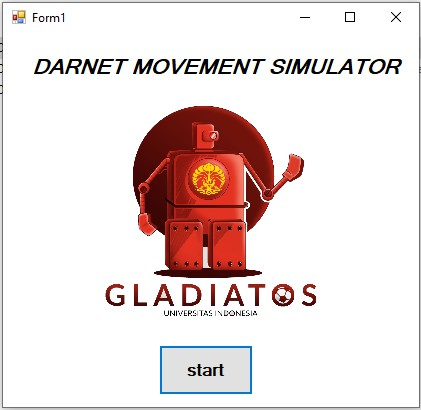
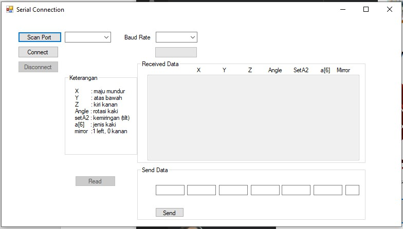

# Project-Darnet-Movement
Simulator project for Robotis Darwin OP2 Humanoid Robot
Microcontroller used: OpenCM9.04

This project consist of the Graphical User Interface (GUI) and the serial protocol to simulate the robot movement

Upload the arduino code provided in the Serial_Read_OpenCM file using the OpenCM IDE provided in ROBOTIS website
To use the GUI, download the GUI DMS folder, then go to bin, then debug, then run application

when you run, it will greet you with 

The working windows will look like this

scan port is to refresh and find the com port connected to the PC. Baud rate is to choose the available baud rate for communicating with the OpenCM9.04. After you set the com port and the baud rate, press connect. if you want to change the parameter, just fill in the box to the respective parameter. then click send.

